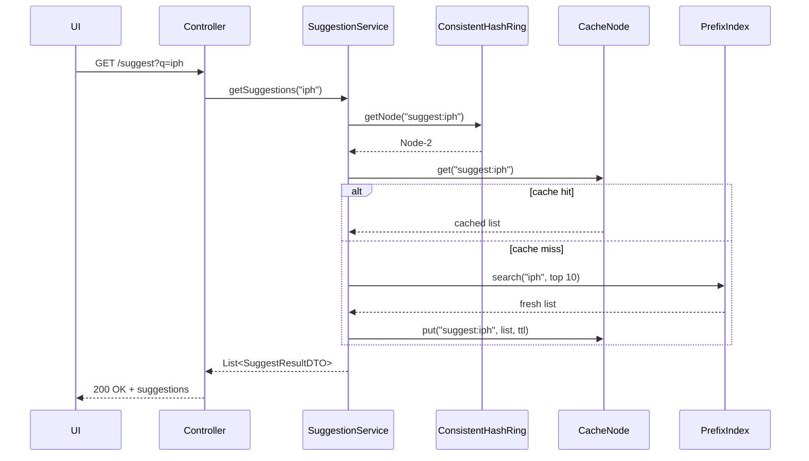
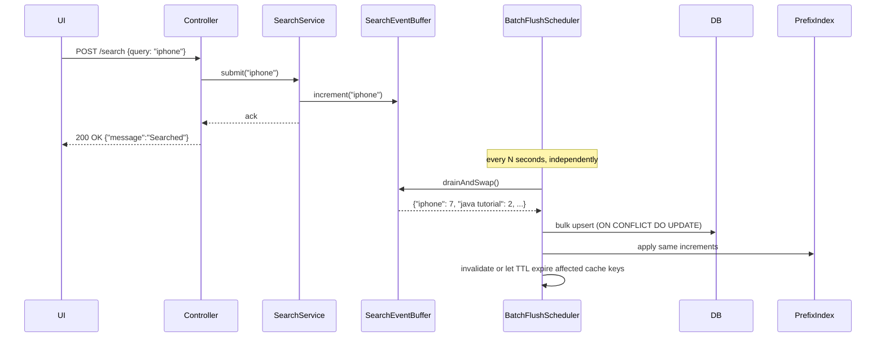

# Search Typeahead System — Project Overview

> This doc explains **what** the project is and **why** it's designed this way.
> For the actual step-by-step backend build instructions, see `prompt.md`.
> Stack target: **Java + Spring Boot**, modular monolith, DTO-first, scalable layered design.

---

## 1. What This Project Actually Is (Plain English)

Strip away the jargon and this assignment is four small systems glued together:

1. A **typeahead** — type `iph`, get back `iphone`, `iphone 15`, `iphone charger`, sorted by popularity.
2. A **counter** — every time someone searches something, bump a counter for that query.
3. A **fast cache layer** — so suggestion lookups don't hit the database every single keystroke.
4. A **write reducer** — so the counter-bumping from #2 doesn't hammer the database on every request either.

Everything else in the spec (consistent hashing, trending, batch writes) is really just "how do we do #3 and #4 properly, at scale, without lying about freshness."

The assignment graders explicitly said: **you must be able to explain every line you submit in a viva**, even if you used AI to help write it. So treat this doc — and `prompt.md` — as your understanding layer, not just a code generator.

---

## 2. Requirements, Broken Down Simply

### 2.1 The core loop

```
User types "iph" → suggestions show up instantly (cached, ranked by popularity + recency)
User hits Enter  → backend says "Searched" and quietly updates that query's count
```

That's the entire product. Everything below is about doing those two actions **fast** and **cheaply**.

### 2.2 Functional requirements (what the system must do)

| #   | Requirement                              | Plain explanation                                                                           |
| --- | ---------------------------------------- | ------------------------------------------------------------------------------------------- |
| 1   | Show 10 suggestions sorted by count      | Prefix search, top 10, most popular first                                                   |
| 2   | UI for search + suggestions              | Search box + dropdown                                                                       |
| 3   | Dummy search API returns "Searched"      | POST endpoint, fake response, but real side-effect (count update)                           |
| 4   | Search-query store updated on submit     | The count for that query goes up by 1 (or gets created)                                     |
| 5   | Decide storage + caching strategy        | Your call — but you must justify it                                                         |
| 6   | Distributed cache via consistent hashing | Multiple **logical** cache nodes, and a hashing scheme decides which node owns which prefix |
| 7   | Trending searches                        | Recent activity should boost ranking, not just all-time count                               |
| 8   | Batch writes                             | Don't write to the DB on every single search — buffer and flush                             |

### 2.3 Required APIs

| Method & Path                      | Purpose             | What it returns                                             |
| ---------------------------------- | ------------------- | ----------------------------------------------------------- |
| `GET /suggest?q=<prefix>`          | Fetch suggestions   | Up to 10 prefix matches, sorted by count                    |
| `POST /search`                     | Submit a search     | `{ "message": "Searched" }` + records the query             |
| `GET /cache/debug?prefix=<prefix>` | Debug cache routing | Which cache node owns this prefix, and was it a hit or miss |

**Recommended (not explicitly required, but implied by the UI spec needing a "trending searches section"):**

| Method & Path   | Purpose                                         |
| --------------- | ----------------------------------------------- |
| `GET /trending` | Top N queries ranked by the recency-aware score |

### 2.4 Non-functional requirements (the "how well" part)

- Easy to run locally (one command, no exotic infra)
- `/suggest` should be **low latency** — this is the whole point of the cache
- You must **measure and report** latency (p95, ideally)
- You must report **cache hit rate** and **DB read/write counts**
- You must show logs/evidence that consistent hashing is actually routing keys to different nodes
- Code must be modular, readable, documented

### 2.5 Where the marks actually are

| Component            | Marks | What's being checked                                                                                                          |
| -------------------- | ----- | ----------------------------------------------------------------------------------------------------------------------------- |
| Basic Implementation | 60    | Dataset loads, search UI works, suggestion + search APIs work, counts update, distributed cache with consistent hashing works |
| Trending Searches    | 20    | Recency-aware ranking works and you can explain the scoring/windowing logic                                                   |
| Batch Writes         | 20    | Writes are actually batched, you can prove the write reduction, and you can discuss what happens on a crash                   |

**Translation:** get the plain CRUD + cache loop rock solid first (60 marks is just "make it work end to end"). Trending and batching are smaller, more conceptual additions on top — don't over-engineer them before the basics are done.

---

## 3. High-Level Architecture (HLD)

```mermaid
flowchart LR
    subgraph Client
        UI["Search UI (React/etc.)\nDebounced input"]
    end

    subgraph Backend["Spring Boot Application (single deployable)"]
        direction TB
        CTRL["Controller Layer\n(REST endpoints)"]
        SVC["Service Layer\n(business logic)"]
        CACHE["Distributed Cache Layer\n(N logical nodes + Consistent Hash Ring)"]
        BUFFER["Write Buffer\n(in-memory, aggregates counts)"]
        SCHED["Batch Flush Scheduler\n(runs every X seconds)"]
        IDX["In-Memory Prefix Index\n(fast fallback on cache miss)"]
    end

    subgraph Storage
        DB[("Primary Data Store\nPostgres: query, count, last_searched_at")]
    end

    UI -- "GET /suggest?q=" --> CTRL
    UI -- "POST /search" --> CTRL
    CTRL --> SVC
    SVC -- "1. check cache first" --> CACHE
    CACHE -- "miss" --> IDX
    IDX -- "cold start / rebuild" --> DB
    SVC -- "search submitted" --> BUFFER
    BUFFER --> SCHED
    SCHED -- "periodic bulk upsert" --> DB
    SCHED -- "update" --> IDX
    SCHED -- "invalidate affected keys" --> CACHE
```



**Why this shape, in one sentence each:**

- **Cache-first reads**: suggestions are read far more often than they change, so we optimize the read path hard.
- **Logical cache nodes**: the assignment wants distribution + consistent hashing, but doesn't require real multi-server infra — you simulate N nodes inside one JVM, each with its own map and its own hit/miss counters. This is completely legitimate and is what the assignment means by "logical cache nodes."
- **In-memory prefix index**: with 100k+ queries, a real database `LIKE 'iph%'` query is too slow to hit on every cache miss. An in-memory structure (Trie or sorted map) makes the fallback path fast too.
- **Buffer + scheduler instead of writing directly**: every search submission would otherwise be a DB write. Batching turns thousands of writes into a handful of bulk upserts.

---

## 4. System Design Deep-Dive

### 4.1 How a suggestion request is actually served (read path)

1. User types `iph`. Frontend debounces (waits ~200-300ms of no typing) before calling the API — this isn't backend work, but it's why the spec mentions it.
2. `GET /suggest?q=iph` hits the controller.
3. Normalize the input: lowercase, trim whitespace, handle empty string.
4. Compute `cacheKey = "suggest:iph"`.
5. Ask the **Consistent Hash Ring**: "which cache node owns this key?" → e.g. Node 2.
6. Check Node 2's local cache map for that key.
   - **Hit** → return cached list immediately. Fastest path, no DB involved.
   - **Miss** → fall through to step 7.
7. Query the **in-memory prefix index** for everything starting with `iph`, sorted by score, top 10.
8. Store that result back into Node 2's cache with a TTL (say, 60 seconds).
9. Return the result.

This is a textbook **cache-aside** pattern. The only twist the assignment adds is that "the cache" isn't one map — it's N maps, and consistent hashing decides which one a key belongs to.

### 4.2 Consistent Hashing, explained like you're five

**The boring way (don't do this):** `nodeIndex = hash(key) % numberOfNodes`. Works fine — until you add or remove a node. Then almost every key remaps to a different node, and your whole cache goes cold at once. Bad.

**The consistent hashing way:**

1. Imagine a circle (a "ring") of numbers from `0` to `2^32 - 1`.
2. Each cache node gets hashed onto a few hundred random points on that ring (these are called **virtual nodes** — having many per physical node spreads keys evenly instead of clumping).
3. Each _key_ (like `"suggest:iph"`) also gets hashed onto a point on that same ring.
4. To find which node owns a key: start at the key's point and walk **clockwise** until you hit the next node point. That node owns the key.

**Why this is better:** if you add or remove a node, only the keys sitting between that node and the previous one on the ring move. Everything else stays exactly where it was. That's the entire value proposition — minimal disruption when the cluster changes shape.

**How you implement it (simple version):**

```
TreeMap<Long, CacheNode> ring

addNode(node):
    for i in 0..virtualNodeCount:
        hash = hashFunction(node.id + "#" + i)
        ring.put(hash, node)

getNode(key):
    hash = hashFunction(key)
    entry = ring.ceilingEntry(hash)   // first node clockwise
    if entry == null:
        entry = ring.firstEntry()      // wrap around the ring
    return entry.getValue()
```

A `TreeMap` is perfect here because `ceilingKey()` gives you "next key clockwise" in `O(log n)` for free.

**What to show in your demo for this:** hit `GET /cache/debug?prefix=iph` a few times with different prefixes and log which node answered each one — that's your evidence of consistent-hashing behavior the spec asks for.

### 4.3 Trending Searches — recency-aware ranking

**Basic version (60% tier):** sort by `totalCount` only. Done — popular forever, doesn't change with time.

**Enhanced version (the extra 20%):** queries that are suddenly hot right now should outrank queries that were popular six months ago but have gone quiet. The trick is doing this _without_ a separate system — same `/suggest` API, smarter scoring.

**Approach — exponential decay boost:**

```
score(query) = totalCount + (recentCount × decayFactor)

decayFactor = 0.5 ^ (minutesSinceLastSearch / halfLifeMinutes)
```

- `totalCount` — all-time popularity. This is the floor; a genuinely popular query never disappears.
- `recentCount` — how many times it's been searched in the current short window (e.g., the last hour).
- `decayFactor` — starts near `1.0` right after a search, and shrinks toward `0` as time passes. Pick a `halfLifeMinutes` (say, 30) meaning the recency boost halves every 30 minutes.

**Answering the four things the spec demands you explain:**

1. **How recent searches are tracked** — every search submission increments a `recentCount` and updates `lastSearchedAt` on that query's row/cache entry.
2. **How recent activity affects ranking** — it's added as a decaying bonus on top of the base count, so a recent spike temporarily pushes a query up the list.
3. **How you avoid permanently over-ranking a short-lived spike** — the decay factor mathematically guarantees the boost shrinks toward zero over time. You never need a manual "reset" job — it just fades.
4. **How the cache is updated/invalidated when rankings change** — two honest options, pick one and say why:
   - **TTL-based (simpler):** cache entries expire after N seconds regardless, so the score is recalculated periodically. Slightly stale, very simple.
   - **Explicit invalidation (more correct):** when the batch flush updates a query's count, invalidate every cached prefix of that query (`i`, `ip`, `iph`, `ipho`...). More accurate, more code.
   - **Recommended for this assignment:** TTL-based. It's simpler to implement correctly, easier to explain, and the trade-off (a few seconds of staleness) is completely reasonable for a search-suggestion feature — nobody needs millisecond-fresh trending data.

### 4.4 Batch Writes — why and how

**The problem:** if every `POST /search` triggers an immediate `UPDATE query_count SET count = count + 1`, your database becomes the bottleneck under any real load, and you get lock contention on popular rows.

**The fix — buffer, then flush:**

1. `POST /search` arrives → normalize the query → increment an **in-memory counter** for that query in a `ConcurrentHashMap<String, LongAdder>`. Return `{"message": "Searched"}` immediately. No DB call on the hot path.
2. A `@Scheduled` job runs on a timer (e.g., every 5 seconds) **or** triggers early if the buffer grows past a configurable size (e.g., 500 distinct queries).
3. On flush: swap out the current buffer map for a fresh empty one (so new requests aren't blocked), then take the old map and do **one bulk upsert** to the database — e.g. with Postgres:

```sql
INSERT INTO query_count (query, total_count, last_searched_at)
VALUES (?, ?, now())
ON CONFLICT (query)
DO UPDATE SET
    total_count = query_count.total_count + EXCLUDED.total_count,
    last_searched_at = EXCLUDED.last_searched_at;
```

4. Update the in-memory prefix index with the new counts so future cache misses see fresh data.
5. Either invalidate or just let TTL handle the affected cache entries (see 4.3).

**Proving the write reduction:** log `searchesReceived` vs `dbWritesPerformed` over a time window. If 10,000 searches came in and you did 40 bulk-upsert batches, that's your evidence — put it straight in the performance report.

**The failure trade-off you must be able to discuss (this is explicitly graded):**
If the application crashes before a buffer flush, every increment sitting in that in-memory map is lost — those searches are silently undercounted. This is the classic **durability vs. throughput** trade-off:

- You're trading a small, bounded amount of potential data loss (at most one flush interval's worth of counts) for a large reduction in database write pressure.
- For a search-suggestion feature, this is a very reasonable trade — losing a few counts for a short window doesn't meaningfully change rankings.
- If you wanted stronger durability, you'd add a write-ahead log (append each increment to a local file/log before counting it in memory, replay on restart) — mention this as the "if I had more time" answer, you don't need to build it.

### 4.5 Data model

```
query_count
-----------
id               BIGINT (PK)
query_text       TEXT (unique, indexed)
total_count      BIGINT
recent_count     BIGINT        -- resets/decays each window
last_searched_at TIMESTAMP
created_at       TIMESTAMP
```

One table. That's genuinely enough for this assignment — resist the urge to over-normalize.

---

## 5. Low-Level Design (LLD)

### 5.1 Modular monolith — package by feature, not by layer

Instead of one giant `controller/`, `service/`, `repository/` split across the whole app, each **feature module** owns its full vertical slice. This is what makes a modular monolith scalable later — a module can be peeled out into its own service without untangling spaghetti.

```
com.arhan.typeahead
│
├── suggestion/              # everything about serving suggestions
│   ├── SuggestionController.java
│   ├── SuggestionService.java
│   ├── dto/
│   │   ├── SuggestionResponseDTO.java
│   │   └── SuggestResultDTO.java
│
├── search/                  # everything about submitting a search
│   ├── SearchController.java
│   ├── SearchService.java
│   ├── dto/
│   │   ├── SearchRequestDTO.java
│   │   └── SearchResponseDTO.java
│
├── trending/                # ranking/scoring logic
│   ├── TrendingController.java
│   ├── TrendingScoreCalculator.java
│   ├── dto/TrendingResponseDTO.java
│
├── cache/                   # the distributed logical cache
│   ├── CacheController.java         (debug endpoint)
│   ├── ConsistentHashRing.java
│   ├── CacheNode.java
│   ├── CacheNodeManager.java
│   ├── CacheEntry.java
│   ├── dto/CacheDebugResponseDTO.java
│
├── batch/                   # write buffering + flushing
│   ├── SearchEventBuffer.java
│   ├── BatchFlushScheduler.java
│
├── index/                   # in-memory prefix lookup structure
│   ├── PrefixIndex.java             (Trie or NavigableMap-based)
│   ├── PrefixIndexService.java
│
├── data/                    # shared persistence (the one real entity)
│   ├── QueryCount.java              (JPA entity)
│   ├── QueryCountRepository.java
│
├── ingestion/                # one-time dataset load on startup
│   ├── DatasetLoader.java
│
├── common/
│   ├── exception/GlobalExceptionHandler.java
│   ├── exception/ApiException.java
│   └── config/AppConfig.java        (cache node count, TTLs, decay constants)
│
└── TypeaheadApplication.java
```

Each module talks to other modules only through their public service interfaces — never reaches into another module's internals. `suggestion/` calls `cache/` and `index/`, but never touches `data/` directly, for example.

### 5.2 The layers, one at a time

| Layer           | Responsibility                                                                 | Never does                                                 |
| --------------- | ------------------------------------------------------------------------------ | ---------------------------------------------------------- |
| **Controller**  | Accept HTTP request, validate shape, map to/from DTOs, call one service method | Business logic, DB queries, cache logic                    |
| **DTO**         | The shape of data crossing the API boundary                                    | Hold JPA annotations or entity references                  |
| **Service**     | Orchestrate the actual logic — cache lookups, ranking, buffering               | Know about HTTP (no `HttpServletRequest`, no status codes) |
| **Cache layer** | Own the consistent hash ring + N node maps, expose `get/put/invalidate`        | Know about the database                                    |
| **Repository**  | Talk to Postgres via Spring Data JPA                                           | Contain business rules                                     |
| **Index**       | Fast in-memory prefix matching, rebuilt from DB at startup, patched on flush   | Persist anything itself                                    |

**Why DTOs everywhere, not entities:** if `QueryCount` (the JPA entity) leaked straight out of the controller, any change to your table schema would break your API contract, and you'd risk exposing internal fields. DTOs are a deliberate seam between "how I store data" and "how I expose data" — cheap insurance.

### 5.3 Routing — how a request actually travels through the app

Spring Boot's `DispatcherServlet` is the front door for every request. Concretely:

```
HTTP request lands
        │
        ▼
DispatcherServlet (Spring's built-in router)
        │  matches path + method against @GetMapping/@PostMapping
        ▼
SuggestionController.suggest(@RequestParam q)
        │  validates "q", builds nothing fancy — delegates immediately
        ▼
SuggestionService.getSuggestions(prefix)
        │  1. cacheNodeManager.get(cacheKey)
        │  2. miss → prefixIndexService.search(prefix)
        │  3. cacheNodeManager.put(cacheKey, result, ttl)
        ▼
returns List<SuggestResultDTO>
        │
        ▼
Controller wraps it in SuggestionResponseDTO, Spring serializes to JSON
        │
        ▼
HTTP response
```

Same shape for `POST /search`, except the service call ends in `searchEventBuffer.increment(query)` instead of a cache read, and the controller returns a fixed `{ "message": "Searched" }` payload immediately — the actual DB write happens later, asynchronously, on the scheduler's own thread.

### 5.4 Key classes and what they're responsible for

| Class                     | Responsibility                                                                                                                                       |
| ------------------------- | ---------------------------------------------------------------------------------------------------------------------------------------------------- |
| `ConsistentHashRing`      | `TreeMap<Long, CacheNode>`; `addNode()`, `removeNode()`, `getNode(key)`                                                                              |
| `CacheNode`               | Holds an id + its own `Map<String, CacheEntry>`; tracks its own hit/miss counters                                                                    |
| `CacheNodeManager`        | Owns the ring + the list of `CacheNode`s; exposes `get/put/invalidate(key)` to the rest of the app                                                   |
| `CacheEntry`              | `value`, `expiresAt` — simple TTL wrapper                                                                                                            |
| `PrefixIndex`             | In-memory structure (Trie, or a `TreeMap<String, QueryCount>` using `subMap()` for prefix range scans) for fast "everything starting with X" lookups |
| `SearchEventBuffer`       | `ConcurrentHashMap<String, LongAdder>`; thread-safe increment + atomic drain-and-swap                                                                |
| `BatchFlushScheduler`     | `@Scheduled` method; drains the buffer, bulk-upserts, updates index, invalidates/expires cache                                                       |
| `TrendingScoreCalculator` | Pure function: `(totalCount, recentCount, lastSearchedAt) -> score`                                                                                  |
| `DatasetLoader`           | `@PostConstruct`/`CommandLineRunner` that reads the CSV, bulk-inserts into Postgres, and builds the initial `PrefixIndex`                            |

### 5.5 Sequence — a suggestion request, start to finish



### 5.6 Sequence — a search submission, start to finish



---

## 6. Folder Structure (Maven project)

```
typeahead/
├── pom.xml
├── README.md
├── src/main/java/com/arhan/typeahead/
│   ├── TypeaheadApplication.java
│   ├── suggestion/...
│   ├── search/...
│   ├── trending/...
│   ├── cache/...
│   ├── batch/...
│   ├── index/...
│   ├── data/...
│   ├── ingestion/...
│   └── common/...
├── src/main/resources/
│   ├── application.yml
│   └── dataset/queries.csv
└── src/test/java/com/arhan/typeahead/
    ├── cache/ConsistentHashRingTest.java
    ├── suggestion/SuggestionServiceTest.java
    └── batch/BatchFlushSchedulerTest.java
```

---

## 7. What You Must Be Able to Explain in the Viva

Don't skip this — the spec is explicit that an unexplainable submission counts as plagiarism even if it runs. Make sure you can talk through, unscripted:

- Why a `TreeMap` + virtual nodes gives you consistent hashing, and what breaks without it
- What happens, step by step, on a cache hit vs. a cache miss
- Why search submissions don't write to the DB synchronously, and what you lose by doing that (the crash trade-off)
- The exact formula behind your trending score and why it naturally fades instead of needing a reset job
- Why DTOs exist instead of returning entities directly
- What your p95 latency number is, and roughly why it's that number (cache hit path is fast, miss path hits the in-memory index, not a slow DB scan)
- Which design pattern / SOLID principle shows up in which class, and why it was the right call there (see `prompt.md` — every phase names its patterns explicitly, on purpose, so you can answer this)

---

## 8. Tools to Use to Build This Project

You don't need anything exotic — this is a deliberately lean toolchain.

| Tool                                                                     | Used for                                                                                                                                  |
| ------------------------------------------------------------------------ | ----------------------------------------------------------------------------------------------------------------------------------------- |
| **IntelliJ IDEA** (Community is enough)                                  | Primary IDE — best Spring Boot support, run configs, debugger                                                                             |
| **Maven** (+ the `mvnw` wrapper)                                         | Build, dependency management, packaging                                                                                                   |
| **Postman** (or Insomnia/Bruno)                                          | Manually hitting `/suggest`, `/search`, `/cache/debug`, `/trending` during development                                                    |
| **Swagger UI** (free once `springdoc-openapi` is added)                  | Live, auto-generated API documentation — satisfies the "API documentation" submission requirement                                         |
| **Docker + docker-compose**                                              | Spin up a local Postgres instance without installing it natively (optional — the H2 profile also works for pure local dev)                |
| **pgAdmin / DBeaver / TablePlus**                                        | Inspecting the `query_count` table directly while debugging batch writes                                                                  |
| **Git + GitHub**                                                         | Version control and the actual submission target ("GitHub repository or equivalent source-code submission")                               |
| **k6** (or Apache JMeter)                                                | Load-testing `/suggest` to actually generate the p95 latency and cache-hit-rate numbers your performance report needs                     |
| **Mermaid** (already used in this doc)                                   | Architecture/sequence diagrams for the README — renders natively on GitHub                                                                |
| **JUnit 5 + Mockito + AssertJ** (bundled via `spring-boot-starter-test`) | Unit and integration tests across all phases                                                                                              |
| A lightweight frontend (plain HTML/JS, or a small React app)             | Just enough for the search box, suggestion dropdown, and trending section the UI spec asks for — not the focus of grading, keep it simple |

---

## 9. Build Phases at a Glance

The actual build is broken into **10 phases** in `prompt.md`, each a self-contained prompt you feed to your AI coding tool one at a time, in order. Don't skip ahead — later phases depend on earlier ones being correct and understood.

| #   | Phase                                  | Covers                                                   |
| --- | -------------------------------------- | -------------------------------------------------------- |
| 1   | Project Bootstrap & Foundation         | Skeleton, config, profiles, exception handling base      |
| 2   | Data Model & Persistence Layer         | `QueryCount` entity, repository, schema migration        |
| 3   | Dataset Ingestion                      | CSV/synthetic loading, 100k+ rows, idempotent startup    |
| 4   | In-Memory Prefix Index                 | Fast prefix lookups backing the suggestion API           |
| 5   | Suggestion API (Basic Ranking)         | `GET /suggest`, DTOs, count-only ranking, edge cases     |
| 6   | Search Submission API (Temporary)      | `POST /search`, synchronous baseline write               |
| 7   | Distributed Cache + Consistent Hashing | Cache nodes, ring, cache-aside read path, `/cache/debug` |
| 8   | Trending / Recency-Aware Ranking       | Decay scoring, `/trending`, strategy pattern             |
| 9   | Batch Writes                           | Buffer + scheduler, replaces Phase 6's direct write      |
| 10  | Observability, Resilience, Docs        | p95 latency, hit rate, README, performance report        |

This order matches the grading weight: Phases 1-7 cover the 60-mark basic-implementation tier, Phase 8 covers the 20-mark trending tier, Phase 9 covers the 20-mark batching tier, and Phase 10 produces the documentation artifacts the submission checklist requires.
