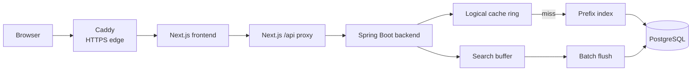

# Architecture Diagram

This page gives a simple view of the TypeAhead runtime shape.

## Diagram

## Simple explanation

### Read path

1. The browser opens the frontend through Caddy on HTTPS.
2. The frontend calls local Next.js proxy routes.
3. The proxy forwards the request to Spring Boot.
4. The backend checks the logical cache first.
5. If the cache misses, it reads from the in-memory prefix index.

### Write path

1. The browser submits a search.
2. The backend stores that event in an in-memory buffer.
3. A scheduled flush writes grouped updates to PostgreSQL.

## Why this shape was used

- HTTPS is handled by Caddy.
- The browser does not need direct CORS access to the backend.
- Suggestion reads stay fast with cache + prefix index.
- Search writes stay cheaper through batching.
