# TypeAhead Project Report

## 1. Architecture

### 1.1 Diagram

```mermaid
flowchart LR
    Caddy["Caddy<br/>HTTPS reverse proxy"]
    Browser["Browser UI<br/>Next.js page"]
    Proxy["Next.js route handlers<br/>/api/* proxy layer"]
    Spring["Spring Boot backend"]
    Cache["Logical cache nodes<br/>+ consistent hash ring"]
    Index["In-memory prefix index"]
    Buffer["Search event buffer"]
    Scheduler["Batch flush scheduler"]
    Postgres[("PostgreSQL query_count")]

    Browser -->|HTTPS| Caddy
    Caddy --> Browser

    Browser -->|GET /api/suggest| Proxy
    Browser -->|POST /api/search| Proxy
    Browser -->|GET /api/trending| Proxy
    Browser -->|GET /api/metrics| Proxy
    Browser -->|GET /api/cache-debug| Proxy

    Proxy -->|forward requests| Spring

    Spring --> Cache
    Cache -->|miss| Index
    Spring --> Buffer
    Buffer --> Scheduler
    Scheduler --> Postgres
    Scheduler --> Index
    Scheduler --> Cache
    Index --> Postgres
```



### 1.2 Clear architecture explanation

The delivered runtime shape is:

1. The browser reaches the frontend through Caddy over `https://localhost`.
2. Caddy reverse proxies the request to the Next.js app.
3. The browser talks only to the Next.js app.
4. Next.js route handlers under `client/app/api/*` proxy those calls to the Spring Boot backend.
5. The Spring backend serves read traffic through a cache-first suggestion flow:
   - `SuggestionController` -> `SuggestionService`
   - `CacheNodeManager` routes keys with consistent hashing
   - cache miss falls through to `PrefixIndexService`
6. Search submissions go through `SearchService`, which buffers events in memory and relies on scheduled batch flushes to reduce database writes.
7. Metrics and cache-debug endpoints expose internal behavior for validation and reporting.

Why the extra Next proxy layer exists:

- It removes browser CORS dependence.
- It lets the frontend use stable relative URLs like `/api/suggest`.
- It works both in local dev and in Docker, as long as `TYPEAHEAD_API_BASE_URL` points at the backend.

## 2. Dataset Source And Loading Instructions

### 2.1 Actual dataset source in this repo

The current repo does **not** include a checked-in CSV dataset at:

- `server/src/main/resources/dataset/queries.csv`

Because that file is absent, the backend currently falls back to:

- `server/src/main/java/com/lowkeyarhan/TypeAhead/modules/ingestion/service/impl/SyntheticDatasetSource.java`

That generator creates:

- `100000` unique query strings
- lowercased synthetic phrases
- a Zipf-like count distribution, so a small set of queries are very popular and the rest form a long tail

### 2.2 Loading behavior

Startup ingestion is handled by:

- `server/src/main/java/com/lowkeyarhan/TypeAhead/modules/ingestion/service/DatasetLoader.java`

Behavior:

1. Count rows in `query_count`.
2. If rows already exist, skip ingestion.
3. Try CSV source first.
4. If CSV returns empty, generate the synthetic dataset.
5. Aggregate duplicates.
6. Batch insert into PostgreSQL.
7. Publish `DatasetLoadedEvent`, which triggers prefix-index rebuild.

### 2.3 How to reload the dataset

1. Ensure PostgreSQL is running.
2. Clear existing rows or recreate the database volume.
3. Start the backend.
4. On first startup the loader repopulates `query_count`.

If you want a real CSV-backed run, place a file at:

- `server/src/main/resources/dataset/queries.csv`

Expected columns:

- `query`
- `count`

## 3. API Documentation

Swagger/OpenAPI is exposed by the backend at:

- `http://localhost:8080/swagger-ui.html`
- `http://localhost:8080/v3/api-docs`

The frontend uses these backend endpoints through its local proxy routes.

### 3.1 Suggest

- Backend: `GET /suggest?q=<prefix>&limit=<n>`
- Frontend proxy: `GET /api/suggest?q=<prefix>&limit=<n>`

Example:

```json
{
  "prefix": "java",
  "suggestions": [
    { "query": "java validation controller", "count": 105112 },
    { "query": "java thread", "count": 77550 }
  ]
}
```

### 3.2 Search submit

- Backend: `POST /search`
- Frontend proxy: `POST /api/search`

Request body:

```json
{
  "query": "java spring"
}
```

Response:

```json
{
  "message": "Searched"
}
```

### 3.3 Trending

- Backend: `GET /trending?limit=<n>`
- Frontend proxy: `GET /api/trending?limit=<n>`

Example:

```json
{
  "trending": [
    { "query": "css iphone javascript", "count": 500000 },
    { "query": "vue", "count": 297302 }
  ]
}
```

### 3.4 Metrics

- Backend: `GET /metrics`
- Frontend proxy: `GET /api/metrics`

Example:

```json
{
  "suggestP95LatencyMs": 0.0,
  "overallCacheHitRate": 0.5,
  "perNodeCacheHitRates": {
    "node-0": 0.5,
    "node-1": 0.0,
    "node-2": 0.0
  },
  "dbReadCount": 2,
  "dbWriteCount": 1,
  "requestsToFlushesRatio": 1.0
}
```

### 3.5 Cache debug

- Backend: `GET /cache/debug?prefix=<prefix>&limit=<n>`
- Frontend proxy: `GET /api/cache-debug?prefix=<prefix>&limit=<n>`

Example:

```json
{
  "nodeId": "node-0",
  "hit": true
}
```

## 4. Design Choices And Trade-offs

### 4.1 Next.js proxy instead of direct browser-to-backend calls

Choice:

- Added `client/app/api/*` route handlers that forward to Spring Boot.

Why:

- Avoids CORS configuration as a frontend dependency.
- Keeps the UI code simple and environment-agnostic.
- Fixes Docker networking cleanly by using `TYPEAHEAD_API_BASE_URL=http://server:8080`.

Trade-off:

- One extra hop through the Next server.
- Slightly more code than direct `fetch("http://localhost:8080/...")`.

### 4.2 Keep the frontend minimal, but split responsibilities cleanly

Choice:

- Kept the same minimal screen, but split it into focused React components and one dashboard hook.

Why:

- The page is easier to read and maintain.
- UI rendering and data orchestration are separated.
- Static UI copy now lives in JSON under `client/data`.

Trade-off:

- There are more files in the frontend module.
- The structure is slightly heavier than a single page file, but much easier to extend safely.

### 4.3 Use backend metrics as the source of truth

Choice:

- The diagnostics panel reads `/metrics` instead of recomputing local approximations.

Why:

- Prevents frontend/backend drift.
- The report and UI are based on the same runtime counters.

Trade-off:

- Metrics visibility depends on backend availability.
- When the backend is offline, the page can only show error state, not fake numbers.

### 4.4 Synthetic fallback dataset

Choice:

- Accept the current backend behavior: use CSV if present, otherwise generate 100k synthetic queries.

Why:

- The repo does not contain a real dataset file.
- This keeps the app runnable and demoable.

Trade-off:

- The dataset is realistic enough for scale behavior but not domain-authentic.
- Trending/suggestion content is synthetic, so product realism is limited.

## 5. Performance Report

### 5.1 Verification performed in this session

Frontend:

- `client`: `npm run lint` passed
- `client`: `npm run build -- --webpack` passed

Runtime backend evidence gathered from the live local backend on `http://localhost:8080`:

1. `GET /ping` returned `{"status":"ok"}`
2. `GET /suggest?q=java&limit=5` returned ranked suggestions
3. First `GET /cache/debug?prefix=java&limit=5` returned `hit=false`
4. Repeating the same suggest warmed the cache
5. Next `GET /cache/debug?prefix=java&limit=5` returned `hit=true`
6. `POST /search` returned `{"message":"Searched"}`
7. After waiting one flush interval, `GET /metrics` showed `dbWriteCount=1` and `requestsToFlushesRatio=1.0`

### 5.2 Observed metrics snapshot

This is a **smoke-test snapshot**, not a load-test benchmark:

- `suggestP95LatencyMs`: `0.0`
- `overallCacheHitRate`: `0.5`
- `dbReadCount`: `2`
- `dbWriteCount`: `1`
- `requestsToFlushesRatio`: `1.0`

Interpretation:

- Cache behavior was confirmed functionally: miss first, then hit.
- Batch-write behavior was confirmed functionally: one submitted search produced one flushed write after the scheduler window.
- The p95 value is not meaningful yet because the sample size is tiny.

### 5.3 Limitations of this performance section

The current numbers are only suitable as proof of wiring and runtime behavior. They are not sufficient as a serious throughput benchmark because:

- no sustained load was applied
- sample size is very small
- the snapshot comes from a developer machine, not a controlled benchmark harness

For evaluation-quality benchmarking, drive repeated `/suggest` and `/search` traffic and capture:

- p50/p95/p99 suggest latency
- cache hit rate after warm-up
- batch flush frequency under load
- DB writes before vs after batching

## 6. Frontend Wiring Summary

Implemented changes:

- Added Next proxy routes:
  - `client/app/api/suggest/route.ts`
  - `client/app/api/search/route.ts`
  - `client/app/api/trending/route.ts`
  - `client/app/api/metrics/route.ts`
  - `client/app/api/cache-debug/route.ts`
- Added shared proxy helper:
  - `client/lib/backend.ts`
- Replaced mocked frontend data in:
  - `client/app/page.tsx`
- Fixed Docker client wiring in:
  - `compose.yaml`

## 7. Final Commit Hash For Evaluation

Use the repository `HEAD` hash from the final submitted commit.

Important note:

- An exact self-embedded Git commit hash is not stable inside this same report file, because changing the file changes the commit hash.
- For grading, use the exact `git rev-parse HEAD` value from the final repository state you submit.
