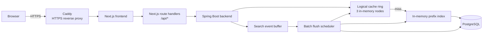

# TypeAhead Project Report

> Verified against the repository source and a live local runtime on `2026-06-22`.

| Field               | Value                                                                                                                                                           |
| ------------------- | --------------------------------------------------------------------------------------------------------------------------------------------------------------- |
| Frontend            | `Next.js 16.2.9`, `React 19.2.4`, `Tailwind CSS v4`                                                                                                             |
| Backend             | `Spring Boot 4.1.0`, `Java 26`                                                                                                                                  |
| Primary persistence | `PostgreSQL`                                                                                                                                                    |
| HTTPS edge          | `Caddy 2.10`                                                                                                                                                    |
| Current status      | Frontend lint passed, frontend production build passed, live backend smoke test passed, backend Maven test suite currently blocked by local test DB credentials |

---

## Table of Contents

1. [Executive Summary](#1-executive-summary)
2. [Architecture](#2-architecture)
3. [Implementation Snapshot](#3-implementation-snapshot)
4. [Dataset and Bootstrapping](#4-dataset-and-bootstrapping)
5. [API Surface](#5-api-surface)
6. [Caching, Ranking, and Write Path](#6-caching-ranking-and-write-path)
7. [Verification Results](#7-verification-results)
8. [Design Decisions and Trade-offs](#8-design-decisions-and-trade-offs)
9. [Known Gaps and Risks](#9-known-gaps-and-risks)

---

## 1. Executive Summary

TypeAhead is a search suggestion platform with a split frontend and backend:

- The browser reaches the UI through `Caddy` over `https://localhost`.
- The browser talks only to `Next.js` proxy routes under `client/app/api/*`.
- Those routes forward requests to the `Spring Boot` backend.
- Suggestions are served through a cache-first flow backed by a custom in-memory consistent-hash cache ring and an in-memory prefix index.
- Search submissions are buffered in memory and flushed to PostgreSQL in batches.

The current repository is operational for local runtime use. The live backend responded successfully during this session, and the frontend production build completed successfully. The main outstanding issue is the backend test profile, which currently depends on a PostgreSQL test database credential pair that is not valid in this environment.

---

## 2. Architecture

### 2.1 Runtime Diagram



### 2.2 Read Path

1. The browser opens the frontend through `https://localhost`.
2. Caddy reverse proxies to the internal Next.js container on port `3000`.
3. The frontend calls local proxy routes such as `/api/suggest`.
4. The proxy forwards requests to the Spring Boot backend.
5. `SuggestionServiceImpl` checks the logical cache ring first.
6. On a miss, the backend searches the in-memory prefix index and ranks the full candidate set before limiting the response.

### 2.3 Write Path

1. The browser submits a query through `POST /api/search`.
2. The backend normalizes the query and increments an in-memory buffer.
3. A flush happens either:
   - on the configured scheduler interval, or
   - early when the buffer reaches the configured size threshold.
4. The flush batches updates into PostgreSQL and applies the delta to the in-memory prefix index.

### 2.4 Why the Next.js Proxy Layer Exists

- It removes browser-side CORS dependence.
- It lets the frontend use stable relative paths like `/api/suggest`.
- It works both in local development and in Docker by changing only `TYPEAHEAD_API_BASE_URL`.

---

## 3. Implementation Snapshot

### 3.1 Service Layout

| Layer            | Implementation                                            | Notes                                                                   |
| ---------------- | --------------------------------------------------------- | ----------------------------------------------------------------------- |
| Frontend UI      | `client/app/page.tsx` and `client/components/dashboard/*` | Search UI, trending panel, runtime panel, cache panel                   |
| Frontend proxy   | `client/app/api/*`                                        | Suggest, search, trending, metrics, cache debug                         |
| Backend API      | Spring MVC controllers                                    | `/ping`, `/suggest`, `/search`, `/trending`, `/metrics`, `/cache/debug` |
| Query store      | PostgreSQL `query_count` table                            | Migrated by Flyway                                                      |
| Suggestion index | `PrefixIndexServiceImpl`                                  | In-memory `TreeMap` with copy-on-write rebuild/update behavior          |
| Cache            | `CacheNodeManager` + `ConsistentHashRing`                 | Hand-rolled logical cache ring, not Redis-backed query caching          |
| Search batching  | `SearchEventBuffer` + `BatchFlushScheduler`               | In-memory aggregation plus JDBC batch updates                           |

### 3.2 Active Configuration

Values below come from `server/src/main/resources/application.yml`.

| Setting                         | Value                  |
| ------------------------------- | ---------------------- |
| Cache node count                | `3`                    |
| Virtual nodes per physical node | `150`                  |
| Cache TTL                       | `60` seconds           |
| Batch flush interval            | `5000` ms              |
| Batch size threshold            | `500` buffered queries |
| Ranking strategy                | `recency-aware`        |
| Ranking half-life               | `30` minutes           |

### 3.3 Infrastructure Footprint

Values below come from `compose.yaml` and `infra/caddy/Caddyfile`.

| Service    | Port / URL      | Purpose                                                                              |
| ---------- | --------------- | ------------------------------------------------------------------------------------ |
| `postgres` | `5432`          | Primary persistence                                                                  |
| `redis`    | `6379`          | Provisioned in the stack, but not used as the active suggestion cache implementation |
| `server`   | `8080`          | Spring Boot backend                                                                  |
| `client`   | internal `3000` | Next.js app                                                                          |
| `caddy`    | `80`, `443`     | HTTP redirect and HTTPS reverse proxy                                                |

### 3.4 Important Clarification About Redis

Redis is present in:

- `compose.yaml`
- `server/pom.xml`

However, the query suggestion cache implemented in this codebase is the custom logical in-memory cache under:

- `server/src/main/java/com/lowkeyarhan/TypeAhead/modules/cache/*`

So the current report treats Redis as provisioned infrastructure, not as the active cache used by the suggestion path.

---

## 4. Dataset and Bootstrapping

### 4.1 Current Dataset Source

The backend first attempts to read:

- `server/src/main/resources/dataset/queries.csv`

That CSV is currently not present in the repository, so startup ingestion falls back to:

- `SyntheticDatasetSource`

### 4.2 Fallback Dataset Characteristics

The fallback generator creates:

- `100000` synthetic query strings
- lowercase, normalized phrases
- an uneven popularity distribution with a high-volume head and long tail

### 4.3 Boot Process

Startup loading is handled by `DatasetLoader`:

1. Count rows in `query_count`.
2. Skip ingestion if the table is already populated.
3. Attempt CSV ingestion first.
4. Fall back to the synthetic generator if the CSV is missing or empty.
5. Aggregate duplicate query rows.
6. Insert rows into PostgreSQL using JDBC batching.
7. Publish `DatasetLoadedEvent`, which triggers a full prefix-index rebuild.

### 4.4 Reload Instructions

To force a fresh load:

1. Stop the app.
2. Clear the existing `query_count` rows or recreate the PostgreSQL volume.
3. Restart the backend.
4. On boot, the loader will repopulate the table and rebuild the in-memory index.

If you want a CSV-backed run instead of synthetic data, create:

- `server/src/main/resources/dataset/queries.csv`

Expected columns:

- `query`
- `count`

---

## 5. API Surface

### 5.1 Public Backend Endpoints

| Method | Route                                    | Purpose                             |
| ------ | ---------------------------------------- | ----------------------------------- |
| `GET`  | `/ping`                                  | Health check                        |
| `GET`  | `/suggest?q=<prefix>&limit=<n>`          | Prefix-based suggestions            |
| `POST` | `/search`                                | Submit a search event               |
| `GET`  | `/trending?limit=<n>`                    | Global trending queries             |
| `GET`  | `/metrics`                               | Runtime telemetry                   |
| `GET`  | `/cache/debug?prefix=<prefix>&limit=<n>` | Cache allocation and hit/miss state |

### 5.2 Frontend Proxy Endpoints

The browser uses these local Next.js routes:

- `/api/suggest`
- `/api/search`
- `/api/trending`
- `/api/metrics`
- `/api/cache-debug`

### 5.3 OpenAPI / Swagger

Backend API docs are exposed at:

- `http://localhost:8080/swagger-ui.html`
- `http://localhost:8080/v3/api-docs`

### 5.4 Request and Response Examples

#### Suggest

Request:

```http
GET /suggest?q=java&limit=5
```

Response observed in this session:

```json
{
  "prefix": "java",
  "suggestions": [
    { "query": "java validation controller", "count": 105112 },
    { "query": "java thread", "count": 77550 },
    { "query": "java typescript", "count": 20442 },
    { "query": "java spring", "count": 16433 },
    { "query": "java handler", "count": 13538 }
  ]
}
```

#### Search

Request:

```json
{
  "query": "java spring"
}
```

Response:

```json
{
  "message": "Searched"
}
```

#### Trending

Response observed in this session:

```json
{
  "trending": [
    { "query": "css iphone javascript", "count": 500000 },
    { "query": "vue", "count": 297302 },
    { "query": "branch concurrency microservice", "count": 219346 },
    { "query": "branch angular push", "count": 176777 },
    { "query": "push example dockerfile", "count": 149535 }
  ]
}
```

#### Metrics

Fresh metrics snapshot after one submitted search and one flush interval:

```json
{
  "suggestP95LatencyMs": 0.0,
  "overallCacheHitRate": 0.0,
  "perNodeCacheHitRates": {
    "node-0": 0.0,
    "node-1": 0.0,
    "node-2": 0.0
  },
  "dbReadCount": 2,
  "dbWriteCount": 1,
  "requestsToFlushesRatio": 1.0
}
```

#### Cache Debug

Response format:

```json
{
  "nodeId": "node-0",
  "hit": true
}
```

---

## 6. Caching, Ranking, and Write Path

### 6.1 Suggestion Caching

Suggestion cache keys use this shape:

```text
suggest:<normalized-prefix>:<limit>
```

Behavior:

1. `SuggestionServiceImpl` checks the routed cache node first.
2. A hit returns cached `SuggestResultDTO` values immediately.
3. A miss triggers a full prefix-index search for that prefix.
4. The ranking strategy scores the full candidate set and only then applies the requested limit.
5. The final result list is cached with the configured TTL.

### 6.2 Ranking Strategy

The active strategy is `recency-aware`.

The score formula is effectively:

```text
score = totalCount + recentCount * 0.5^(minutesSinceLastSearch / halfLifeMinutes)
```

Current half-life:

- `30` minutes

What this means:

- historically popular queries remain strong because `totalCount` is persistent
- recently searched queries get a temporary boost
- the boost decays as time passes

### 6.3 Write Buffering

`POST /search` does not write each event directly to PostgreSQL.

Instead:

1. the query is normalized
2. an in-memory counter is incremented
3. the scheduler drains the buffer every `5000` ms
4. the scheduler issues a JDBC batch upsert into `query_count`
5. the scheduler applies the same delta to the in-memory prefix index

This keeps the read path fast and reduces write amplification on the database.

### 6.4 Fresh Runtime Behavior Confirmed in This Session

- `GET /suggest?q=java&limit=5` returned live data from the running backend.
- `GET /cache/debug?prefix=java&limit=5` returned `hit=true` after that request, confirming cache warming.
- `POST /search` for `java spring` succeeded.
- After one scheduler interval, `dbWriteCount` increased from `0` to `1`.
- After the flush, `GET /cache/debug?prefix=java&limit=10` returned `hit=false`, then `GET /suggest?q=java&limit=10` returned `java spring` with count `16434`, and a repeated cache-debug call returned `hit=true`.

That sequence confirms:

- cache fill works
- buffered writes flush successfully
- the in-memory index is updated after flush
- live counts are reflected in new suggestion responses

---

## 7. Verification Results

### 7.1 Checks Completed Successfully

| Check                               | Result                        |
| ----------------------------------- | ----------------------------- |
| `client: npm run lint`              | Passed                        |
| `client: npm run build`             | Passed                        |
| `GET /ping`                         | Passed with `{"status":"ok"}` |
| `GET /suggest?q=java&limit=5`       | Passed                        |
| `GET /trending?limit=5`             | Passed                        |
| `POST /search`                      | Passed                        |
| `GET /metrics` after flush interval | Passed                        |

### 7.2 Backend Test Suite Status

`server: ./mvnw test` does not currently pass in this environment.

The elevated run removed the sandbox/network ambiguity and exposed the actual issue:

- the `test` profile connects to `localhost:5432/testdb`
- it authenticates as `testuser`
- PostgreSQL currently rejects that credential with `FATAL: password authentication failed for user "testuser"`

So the present failure is environmental configuration, not a shell sandbox artifact.

### 7.3 Notes About the Metrics Snapshot

The live metrics currently show:

- `suggestP95LatencyMs = 0.0`
- `overallCacheHitRate = 0.0`
- `dbReadCount = 2`
- `dbWriteCount = 1`
- `requestsToFlushesRatio = 1.0`

This is useful as a smoke-test snapshot only. It is not a meaningful benchmark because the sample size is tiny and no sustained load was applied.

---

## 8. Design Decisions and Trade-offs

### 8.1 Next.js Proxy Instead of Browser-to-Backend Calls

**Choice**

Use Next.js route handlers as a stable proxy layer.

**Benefit**

- simpler browser code
- no direct browser CORS dependence
- one deployment pattern for both local and Docker use

**Trade-off**

- one extra server hop
- more code than direct browser fetches to the backend

### 8.2 Custom Cache Ring Instead of a Library-Managed Cache

**Choice**

Implement consistent hashing and node-level hit/miss tracking directly in the backend.

**Benefit**

- demonstrates the assignment objective explicitly
- makes routing, invalidation, and diagnostics visible

**Trade-off**

- fewer production-grade features than a mature cache system
- more responsibility for invalidation correctness and operational hardening

### 8.3 In-Memory Prefix Index

**Choice**

Keep a copy-on-write in-memory `TreeMap` for prefix lookup.

**Benefit**

- fast prefix range scans
- no database round-trip on the suggestion hot path after boot

**Trade-off**

- memory usage grows with dataset size
- index rebuild and lifecycle management remain application concerns

### 8.4 Buffered Database Writes

**Choice**

Buffer search traffic and flush in batches.

**Benefit**

- reduces direct write pressure on PostgreSQL
- keeps the write path simple and cheap for demo-scale workloads

**Trade-off**

- a crash can lose unflushed in-memory events
- read-after-write consistency depends on the flush cycle

### 8.5 Synthetic Dataset Fallback

**Choice**

Keep the app runnable even without a checked-in CSV dataset.

**Benefit**

- zero manual data import required
- the app remains demoable immediately

**Trade-off**

- query content is synthetic rather than domain-authentic
- relevance realism is limited even though scale behavior is preserved

---

## 9. Known Gaps and Risks

### 9.1 Backend Tests Depend on External Test DB Credentials

The test profile expects:

- database: `testdb`
- user: `testuser`
- password: `testpassword`

Those credentials are not currently valid in this environment, so `./mvnw test` fails before the suite can fully execute.

### 9.2 Cache Invalidation Is Limit-Specific

During batch flush, invalidation is currently issued only for cache keys shaped like:

```text
suggest:<prefix>:10
```

That means suggestion caches for other limits such as `5` or `20` are not proactively invalidated by the flush path. Those entries still expire by TTL, but they are not immediately refreshed after a write.

### 9.3 Redis Is Present but Not the Active Query Cache

The repository includes Redis infrastructure and dependencies, but the actual suggestion cache behavior is currently implemented in-process with logical nodes. That distinction should remain explicit in demos and evaluation discussions.

### 9.4 Metrics Are Operational, Not Benchmark-Grade

The existing metrics endpoint is useful for:

- smoke testing
- cache verification
- write-flush verification

It is not yet a substitute for controlled load testing with meaningful p50/p95/p99 latency analysis.
